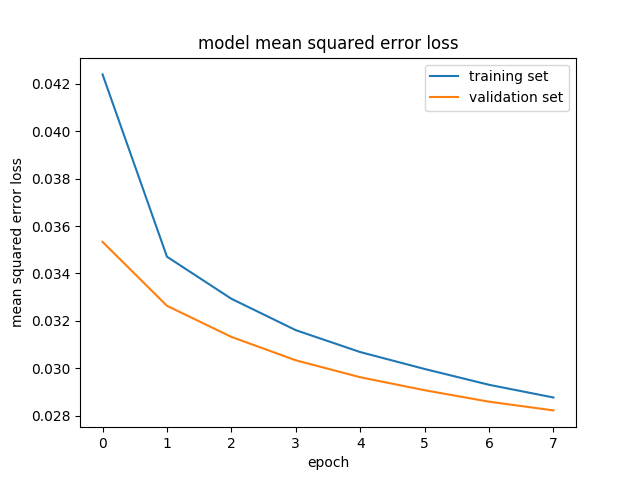

# **Behavioral Cloning** 

## Writeup Template

### You can use this file as a template for your writeup if you want to submit it as a markdown file, but feel free to use some other method and submit a pdf if you prefer.

---

**Behavioral Cloning Project**

The goals / steps of this project are the following:
* Use the simulator to collect data of good driving behavior
* Build, a convolution neural network in Keras that predicts steering angles from images
* Train and validate the model with a training and validation set
* Test that the model successfully drives around track one without leaving the road
* Summarize the results with a written report

The code for training, pre-processing the images, flipping and my pipeline are in the model.py file. I used the same file for training , validating and saving the model.

###Introduction:

The goal of the project is to effectively create a convolutional neural network and train that network to drive a car autonomously in a track. The data used for training is gathered from test track 1 and the eventual result os the model is a steering angle calculation to ensure that the vehicle can drive around the track autonomously without getting off the road. Throttle is handled by the simulator.

I had a bit of trouble gathering data using the simulator, so after several failed attempts, I decided to proceed with the data provided by the Udacity team. The data provided is quite interesting as it contains simulated car dashboard images, as well as images from a left side camera and a right side camera. Additionally a csv file withsteering angle, throttle, brake and speed is provided.

### Model Architecture and Training Strategy

#### Model Architecture:

I started out with implementing the Le Net architecture that was discussed in the classroom but soon found out that this did not provide the necessary behavior.

I worked on improving the pre-processing of the input images. I added a Lambda layer to normalize the images. This improved performance by a little bit.

##### Data Processing
I then proceeded to modify the data provided by the car simulator. Since the simulator always drives counter-clock wise, we observe that the car pulls a little too much to the left. Flipping the image and taking the opposite polarity of the steering angle into the training data allows to overcome the left turn bias.
    Since we receive camera images not only from the center camera , but from the left and right camera as well, these can be added to the training data to provide with more data to train the network. These data will help the vehicle be more centered. We will add a correction value for the left and subtract a correct value for the right steering angle measurement to offset for the camera perspective of steering angle. 
    Additionally analyzing the images shows that the top 1/3 rd of the image just contains environmental data rather than road data. To improve the model training time, the environmental data can br cropped out so that we only feed road data to our model.

##### nVidia Network

After data pre-processing as well, the performance of the LeNet model improved, but it was not enough to make the car run autonomously on the track. So I moved on to the advanced [nVidia](https://devblogs.nvidia.com/parallelforall/deep-learning-self-driving-cars/) architecture which was developed by the nVidia autonomous car group. This worked relatively better with 5 epochs but I realized the validation loss was increasing after 5 epochs. 3 epochs seemed to be the sweet spot.

The structure of the model is as follows:

1. One pre processing cropping layer
2. Three convolutional layers with (5,5) kernels (24, 26 and 48 kernels per layer, correspondingly) with (2,2) strides
3. Two convolutional layers with (3,3) kernels (64 kernels per layer) with (1,1) strides
4. Fourr fully connected layerswith 180, 100,50 and 10 neurons and finally
5. One final output neuron for the steering wheel angle

I used an Adam optimizer for the model.

#### Additional Training Data

I was not successful in training my model to make the car finish the loop just by using the provided data. I gathered more training data by driving the car in the clockwise and counterclockwise direction on track 1 and counterclock wise direction in track 2.

I used a generator to use these four data files, I split the training data and validation data by 70 % and 30 % and the batch sizes in which I split them was 64 samples.

I observed some overfitting when the training error was becoming smaller than the validation error. So I introduced one dropout layer at 0.7. After adding this layer, the validation error was smaller than the training error. I trained for 8 epochs.

 

#### Final Video

Below is the video link for the car driving the loop in the first track.
[first track](run1.mp4)
